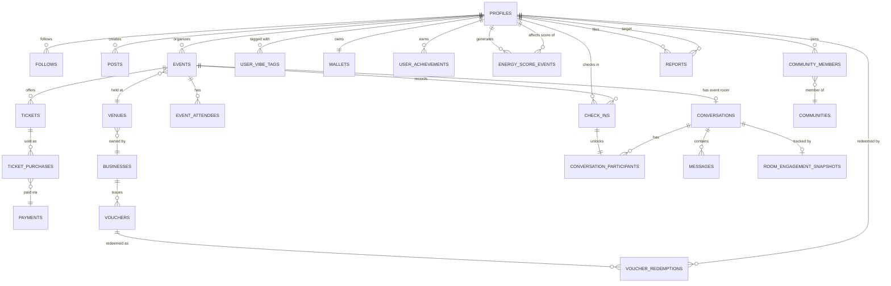

# iTANGO — Database Architecture (Phase 4)

## 1. ERD — Core Domains

The full schema is ~35 tables; shown here grouped by domain with the relationships that matter most. Full DDL is in `migrations/`.

## 2. Design decisions worth flagging

| Decision | Rationale |
|---|---|
| `profiles` table separate from Supabase `auth.users` | `auth.users` is Supabase-managed and off-limits for arbitrary columns; `profiles.id` is a 1:1 FK to `auth.users.id`. This also makes the schema portable if we ever leave Supabase Auth. |
| `check_ins` is its own ledger table, not a boolean on `event_attendees` | Check-in is a trust event with a method (QR/geofence) and timestamp that gates chat access and energy score — it needs to be queryable and auditable independently of RSVP status. |
| `energy_score_events` is an append-only ledger; `profiles.energy_score` is a denormalized cache | Same pattern as double-entry accounting: never overwrite a score, always record the delta and reason, then recompute the cached value. This makes "why did my score change" answerable and makes the percentile-rank job (`Top 5% this month`) a straightforward aggregate query over the ledger rather than an unauditable mutation. |
| `wallets` + `wallet_transactions` mirror `vouchers` + `voucher_redemptions` as separate ledgers | Cash wallet and voucher/loyalty currency are economically different (one is refundable real money via PSPs, the other is a marketing liability issued by businesses) — keeping them as separate ledgers avoids reconciliation ambiguity, even though the UI presents them together in "My Wallet". |
| `conversations` is polymorphic (`type`: dm / group / event_room) rather than three separate tables | Messages, reactions, and participants behave identically regardless of conversation type; only creation rules and access-gating differ, which is handled in RLS policies and application logic, not schema duplication. |
| Geography via PostGIS (`geography(Point, 4326)`) on `venues.location` and `check_ins.location` | Needed for "nearby events," the live crowd-density bubble map, and geofence-based check-in confidence scoring — a plain lat/lng float pair can't do proximity queries efficiently at scale. |
| `room_engagement_snapshots` is written periodically from Redis, not computed live from `messages` | The "🔥 On Fire" / "Heated" room-temperature indicator needs sub-second reads; computing it from a `COUNT(*)` over `messages` on every chat-room render would not scale. Redis holds the rolling window counters; a scheduled job (or Edge Function on a timer) persists snapshots to Postgres for historical/analytics use only. |

## 3. Indexing strategy (applied in DDL, summarized here)

- All foreign keys are indexed (Postgres does not do this automatically).
- `venues.location` and `check_ins.location`: GiST index for proximity queries (`ST_DWithin`).
- `events(start_time, status)`: composite index — the single most common query is "upcoming/live events near me," filtered by status and sorted by time.
- `messages(conversation_id, created_at DESC)`: composite index for paginated chat history.
- `posts(created_at DESC)` and `posts(event_id, created_at DESC)`: feed and event-scoped feed queries.
- Partial index on `tickets` where `quantity_sold < quantity_total` — speeds up "available tickets" checks without scanning sold-out tickets.
- `profiles.username`: unique index (case-insensitive via `citext` or a functional lower() index) for handle lookups and uniqueness enforcement.

## 4. Scale-graduation notes (ties back to the Master Program Plan §7)

- `messages` and `check_ins` are the fastest-growing tables. They're designed with `created_at`-ordered composite indexes now, and are the first candidates for monthly partitioning once volume triggers are hit (see Master Plan scale table).
- `energy_score_events` is append-only by design specifically so it partitions cleanly by month later without any migration of application logic.
