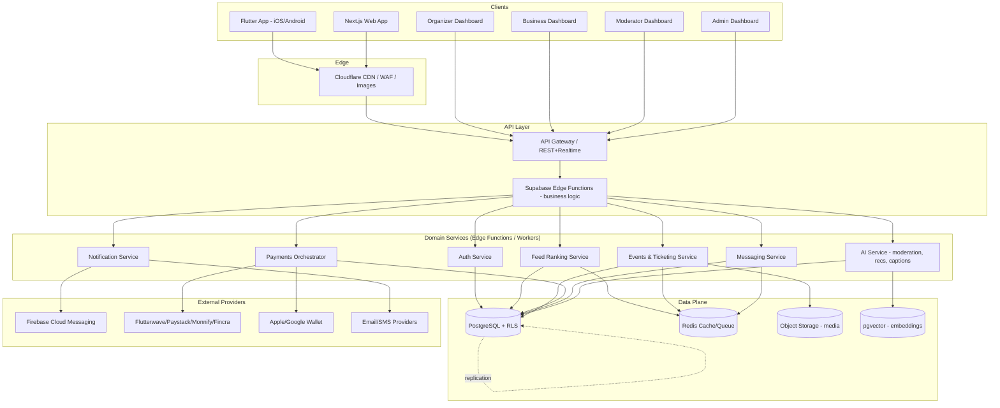
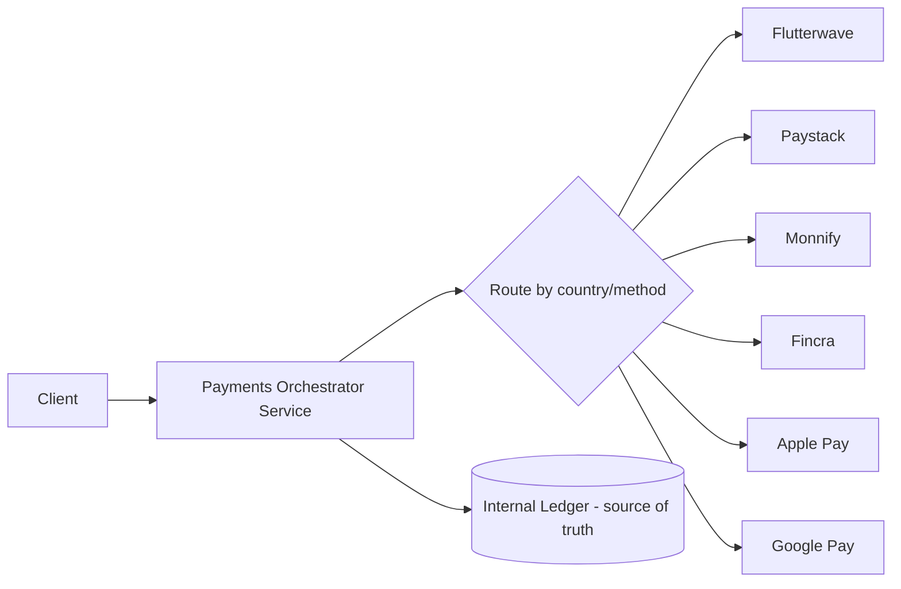

# iTANGO — Master Program Plan
**Social Discovery & Nightlife Platform**
Prepared by: Product, Design, Engineering & Infrastructure Council
Status: Planning / Pre-Phase 1
Version: 1.0

---

## 0. Reality Check & Engagement Model

Before the roadmap, an honest framing — because a venture-backed platform is built on **accurate plans**, not inflated ones.

iTANGO as specified (Flutter + Next.js + 4 dashboards + Supabase/Postgres backend + payments across 5 African PSPs + AI recommendation stack + Kubernetes-ready infra + 100M-user scale target) is realistically:

| Dimension | Estimate |
|---|---|
| Engineering effort | ~120–200 engineer-months for v1 (MVP-to-Series A scope) |
| Team size (real-world) | 15–25 people across the roles you listed |
| Timeline to public launch (v1) | 9–14 months |
| Timeline to "100M-user-ready" infra | Built in from day 1 architecturally, load-tested and scaled incrementally as traffic demands it |

**What this means practically for how we work together:**

- I will produce **real, production-quality artifacts** at every phase — schemas, API contracts, working code, CI/CD configs, security policies — not filler text.
- I will **not** claim to hand you "the finished 100M-user app" in one shot. No engineer worth hiring would claim that, and doing so would mean shipping shallow, non-functional code dressed up to look complete.
- We proceed **phase by phase** (as your own Development Order specifies). Each phase produces a shippable, reviewable artifact set before the next begins.
- **Scale strategy**: architecture is designed *scale-ready* from day one (stateless services, sharded-friendly schema, queue-based fan-out, CDN-first media) but we **implement at MVP scale** (thousands–low millions of users) and graduate components (e.g., single Postgres → read replicas → Citus/sharding; single Redis → Redis Cluster; monolith edge functions → dedicated services) at defined trigger points. This is exactly how Instagram, Discord, and Snap actually scaled — nobody launches with a 100M-user architecture running in production for 50 users; that's the "minimal-scale-that-can-grade-up" principle you specified, and it's correct.

---

## 1. Product Vision & Positioning

**One-line positioning:** *iTANGO is where people discover and do nightlife, events, and social experiences together — the layer between "I'm bored" and "I'm out with people I like."*

**Core insight driving architecture:** Unlike Instagram/TikTok (content-first) or Tinder (matching-first), iTANGO is **event-first**. The Event entity is the graph's center of gravity — feed, chat, communities, ticketing, dating, and business profiles all reference back to Events or Venues. This has a real database-design consequence (see Phase 4): Events and Venues get first-class, heavily-indexed, geo-aware tables, not bolt-on features.

**Primary competitive synthesis:**
| Borrowed from | What iTANGO takes |
|---|---|
| Snapchat | Ephemeral stories, camera-first capture, disappearing messages |
| Instagram | Feed, Reels, profiles, follow graph |
| TikTok | For You algorithmic ranking, short video, sound/trend discovery |
| Eventbrite | Ticketing, seating, organizer tools, payouts |
| Meetup | Communities, interest groups, RSVP culture |
| Tinder | Optional dating layer, swipe/match, safety tooling |
| Discord | Real-time group chat, voice, community roles/permissions |

---

## 2. Guiding Architectural Principles

1. **Event-centric data model** — everything hangs off `events`, `venues`, `users`.
2. **Feature-first, Clean Architecture** on both Flutter and Next.js — domain logic isolated from framework/UI so we can swap Supabase for a custom backend later without a rewrite.
3. **API-first** — every client (Flutter, Next.js, 4 dashboards) talks to the same versioned REST/GraphQL + Realtime contracts. No client-specific backend logic.
4. **Stateless compute, durable state in Postgres/Redis/Storage** — horizontal scaling is just "add pods."
5. **Read/write separation early** — even at small scale, feed and event-discovery reads go through cached/materialized paths, not live joins, because these are the highest-QPS endpoints at any scale.
6. **Security and compliance are Phase 0 concerns, not Phase 14** — RLS policies, encryption, and audit logging are written alongside the schema, not bolted on before launch.
7. **Progressive scaling triggers, defined in advance** (see §7), so "when do we shard/replicate/introduce Kafka" is an engineering decision made *before* it's an emergency.

---

## 3. Final Tech Stack (with trade-off notes)

| Layer | Choice | Why / Trade-off |
|---|---|---|
| Mobile | Flutter + Riverpod + Go Router + Dio | Single codebase iOS/Android; Riverpod > Bloc for this scope: less boilerplate, easier testability, compile-safe DI. Trade-off: smaller talent pool than React Native in some African markets — mitigated by strong internal docs (Phase 7). |
| Web | Next.js (App Router) + TypeScript + Tailwind + shadcn/ui | SSR/ISR for SEO on public event pages (critical for organic growth — event pages *must* be crawlable, unlike a pure SPA). |
| Backend | Supabase (Postgres + Auth + Realtime + Storage + Edge Functions) | Fastest path to production-grade Postgres + RLS + Realtime without building auth/infra from scratch. Trade-off: vendor coupling — mitigated by keeping business logic in Edge Functions/Postgres functions (portable SQL) rather than Supabase-proprietary client tricks, and by designing the schema to be exportable to any managed Postgres. |
| Cache/Queue | Redis (Upstash or self-hosted, graduating to Redis Cluster) | Feed ranking cache, rate limiting, session/presence, job queues (via BullMQ-style or Supabase Queues). |
| CDN/Edge | Cloudflare (CDN, WAF, Images, Turnstile) | DDoS/bot mitigation at the edge before it hits origin — non-negotiable for a public event/ticketing platform. |
| Payments | Flutterwave, Paystack, Monnify, Fincra + Apple Pay/Google Pay | Multi-PSP by design (§9) — Africa-first reality: no single processor has full pan-African coverage or 100% uptime; abstracted behind one internal Payments Service interface. |
| Infra | Docker → Kubernetes-ready (start on managed containers, e.g. AWS ECS/Fly.io/Fargate; migrate to EKS at scale trigger) | Avoids operating a K8s cluster before there's traffic to justify the ops overhead, while keeping manifests K8s-portable from day 1. |
| IaC | Terraform | Environment parity, auditable infra changes. |
| Observability | Prometheus + Grafana + Loki + Sentry | Metrics, dashboards, logs, and error tracking as four distinct, correctly-scoped tools rather than one overloaded system. |
| Analytics | PostHog (product) + Firebase Analytics (mobile engagement) | PostHog for funnels/experiments (self-hostable, GDPR-friendlier); Firebase for mobile crash-free/session metrics and push. |
| AI | Anthropic Claude (moderation, captions, chat assistant, smart search) + pgvector (embeddings for recommendations) | Keeps recommendation infra inside Postgres initially (pgvector) instead of standing up a separate vector DB before it's needed. |

---

## 4. High-Level System Architecture

---

## 5. Program Roadmap (16 Phases)

Each phase below ends with a **Definition of Done** — this is what "complete" means for that phase, so nothing is hand-waved.

| # | Phase | Key Outputs | Definition of Done |
|---|---|---|---|
| 1 | Product Discovery | PRD, personas, competitive teardown, success metrics, MVP scope cut | Written PRD + prioritized backlog (MoSCoW) approved |
| 2 | UX Research | Journey maps, IA, wireframes (low-fi) | Clickable low-fi flow for: onboarding → discover event → buy ticket → check in |
| 3 | Design System | Tokens, typography, color/dark-light, component library, motion spec | Figma-equivalent token set + coded component library (Flutter widgets + React components) |
| 4 | Database Architecture | Full ERD, DDL, indexes, RLS, functions/triggers | Migrations run cleanly on fresh Postgres; RLS tested per role |
| 5 | Backend APIs | OpenAPI spec, Edge Functions, service layer | All P0 endpoints documented + implemented + tested |
| 6 | Authentication | Phone/email/social/biometric OTP, KYC flow | Auth flows pass security review; session/refresh model documented |
| 7 | Flutter App | Feature-first modules per Core Module list | App builds on iOS+Android, core user journey works E2E on staging |
| 8 | Web Dashboard | Next.js public site + organizer/business dashboards | SEO-critical pages SSR'd, Lighthouse ≥ 90 |
| 9 | Admin Portal | Moderation, user mgmt, fraud, audit logs | Role-based access enforced, audit trail verifiable |
| 10 | Payments | Wallet, multi-PSP orchestration, split pay, refunds | Sandbox transactions succeed across all 4 PSPs + Apple/Google Pay |
| 11 | Messaging | 1:1, group, realtime, E2E-encrypted DMs, disappearing msgs | Message delivery <300ms p95 on staging load test |
| 12 | Events (core) | Discovery, booking, ticketing, QR check-in, wallet passes | End-to-end: create event → sell ticket → scan QR at "door" |
| 13 | AI Features | Recs, moderation, fake-account detection, caption gen, AI assistant | Moderation precision/recall benchmarked on labeled test set |
| 14 | Testing | Unit/widget/integration/E2E, load testing | ≥80% coverage on domain layer; load test to defined target QPS |
| 15 | Deployment | Terraform envs, CI/CD, blue/green, monitoring | One-command staging deploy; automated rollback tested |
| 16 | Production Launch | Runbooks, on-call, launch checklist, post-launch monitoring | Go-live checklist signed off by every role above |

---

## 6. Team & RACI (mapped to your listed roles)

| Role | Primary phases | Accountable for |
|---|---|---|
| Senior Product Manager | 1, 16 | Scope, prioritization, success metrics |
| Senior UI/UX Designer | 2, 3 | Flows, wireframes, usability |
| Brand Designer | 3 | Visual identity, motion, brand voice |
| Senior Mobile Engineer (Flutter) | 7 | Mobile app architecture & delivery |
| Senior Frontend Engineer (Next.js) | 8 | Web app, SEO, dashboards |
| Senior Backend Engineer | 4, 5, 10, 11, 12 | API design, business logic, data integrity |
| Senior DevOps Engineer | 15 | CI/CD, deployment, environments |
| Cloud Infrastructure Engineer | 15 | Terraform, scaling, cost |
| Security Engineer | 4, 5, 6, 10 (continuous) | RLS, encryption, OWASP, audits |
| Database Architect | 4 | Schema, indexing, query performance |
| AI Engineer | 13 | Recs, moderation, assistant |
| QA Automation Engineer | 14 (continuous) | Test strategy & coverage |
| Product Growth Engineer | 1, 8, 16 | Onboarding funnels, referral, activation |

---

## 7. Scale Strategy — "Minimal Now, Grade-Up Later"

Concrete triggers, decided now so nobody argues about them under pressure later:

| Trigger | Action |
|---|---|
| Postgres CPU >60% sustained, or feed queries >200ms p95 | Add read replicas; move feed reads to replica |
| >5M events/day in a single table | Partition by month (events, tickets, messages) |
| Single Postgres write throughput ceiling reached | Evaluate Citus / sharding by `region_id` |
| Redis single-node memory >70% | Move to Redis Cluster |
| Media storage/egress cost inflection | Move heavier delivery to Cloudflare Images/Stream + R2 |
| Sustained >10k concurrent WebSocket connections | Split Realtime/Messaging into dedicated horizontally-scaled service (not shared with API pods) |
| Compliance/enterprise demands (SSO, dedicated infra) | Migrate from managed containers to self-managed EKS/GKE |

This table itself is a deliverable your CTO/investors will want to see — it demonstrates the architecture was designed with foresight, not retrofitted under fire.

---

## 8. Security & Compliance Baseline (applies from Phase 4 onward, not just Phase "Security")

- JWT (short-lived) + refresh token rotation via Supabase Auth
- Row Level Security on every table containing user data — no client ever gets a service-role key
- Field-level encryption for sensitive PII (government ID for KYC, payment metadata)
- Rate limiting at Cloudflare edge + application layer (per-IP, per-user, per-endpoint)
- OWASP Top 10 checklist enforced in code review, not just pen-test
- Audit log table (append-only, RLS-locked) for all admin/moderator actions
- GDPR + NDPR (Nigeria Data Protection Act) — data residency notes, right-to-erasure flow, consent capture at onboarding
- Automated encrypted backups with tested restore procedure (not just "backups exist")

---

## 9. Payments Architecture Note (Africa-specific reality)

Because no single PSP has reliable pan-African coverage, payments are built behind one internal interface:

The **internal ledger is the source of truth**, not any PSP's dashboard — critical for split payments, refunds, and organizer payouts to reconcile correctly regardless of which processor handled a given transaction.

---

## 10. Immediate Next Step

Per your own Development Order, we start at **Phase 1: Product Discovery**. Concretely, that means I produce:

1. A formal PRD (problem statement, target users, MVP scope vs. post-MVP, success metrics/KPIs)
2. Primary personas (e.g., "The Promoter," "The Regular," "The Organizer," "The Business Owner")
3. Competitive teardown table (feature-by-feature vs. Eventbrite, Meetup, Tinder, Discord in the African nightlife context)
4. Prioritized backlog (MoSCoW) that defines what actually ships in v1 vs. v2

**Question for you before I generate Phase 1 in full:** do you want me to proceed straight through Phase 1 now, or would you rather I start at a different phase first (e.g., jump to Phase 4 Database Architecture or Phase 3 Design System, since those are often what founders want to see tangible progress on first)? Either is a reasonable entry point — Phase 1 is the "correct" order, but not the only workable one.
